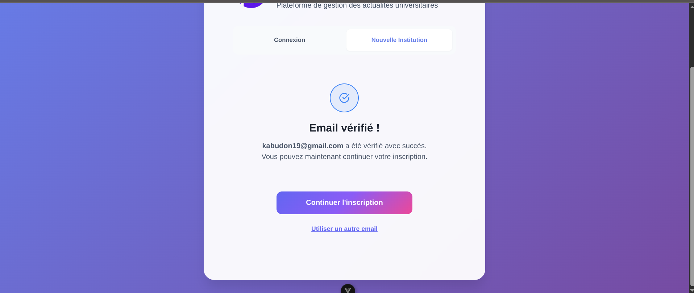
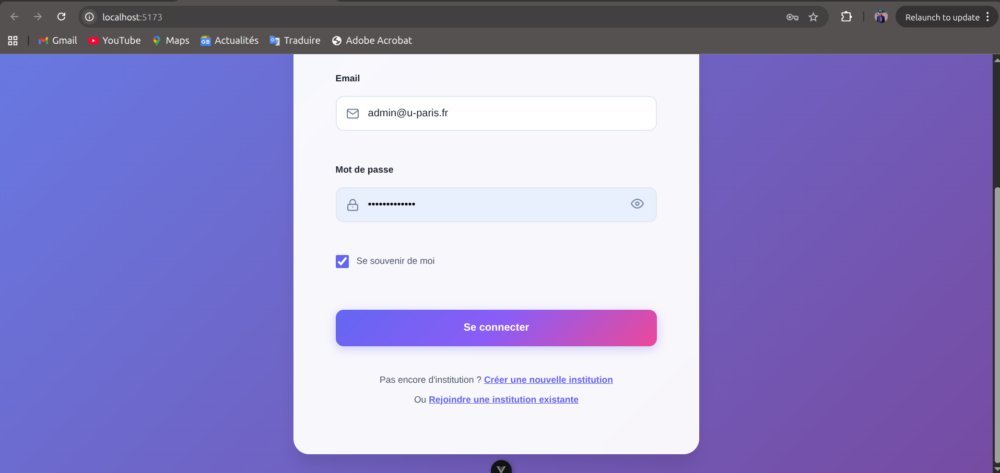
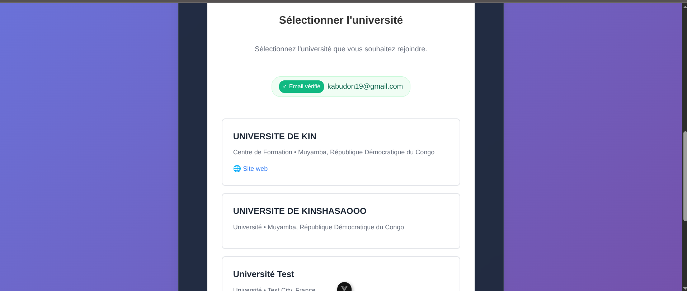
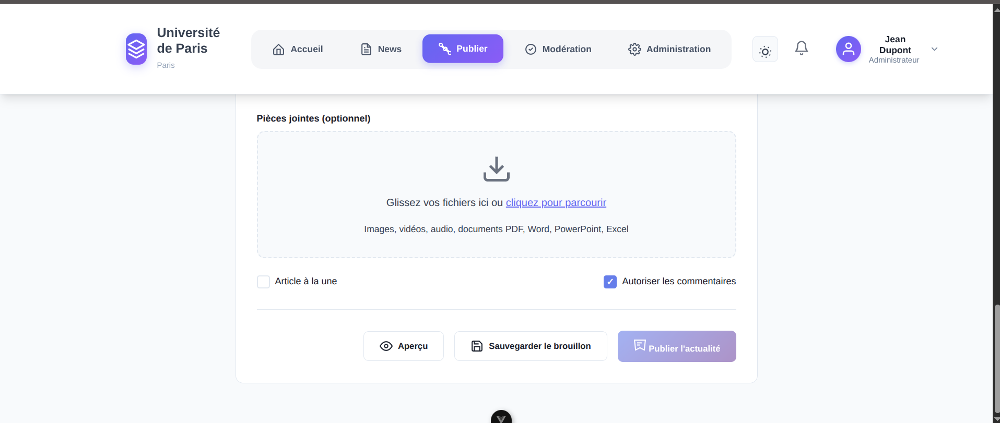

# 🎓 CCC Web News

Plateforme moderne de gestion des actualités universitaires développée avec Vue.js 3 et Vite.


*Interface principale avec navigation et actualités*

## 🚀 Démarrage Rapide

```bash
# Installation et lancement
npm install
npm run dev
```

**➡️ [Guide d'Installation Détaillé](docs/INSTALLATION-RAPIDE.md)**

## 📚 Documentation Complète

### 👤 **Pour les Utilisateurs**
- 📖 **[Guide Utilisateur Complet](docs/GUIDE-UTILISATEUR-COMPLET.md)** - Manuel d'utilisation illustré
- ⚡ **[Installation Rapide](docs/INSTALLATION-RAPIDE.md)** - Commencer en 5 minutes

### 👨‍💻 **Pour les Développeurs** 
- 🔧 **[Documentation Technique](docs/DOCUMENTATION-TECHNIQUE-COMPLETE.md)** - Architecture et API
- 💻 **[Guide de Développement](docs/GUIDE-DEVELOPPEMENT.md)** - Conventions et contribution

### 📸 **Captures d'Écran et Workflows Complets**
Découvrez l'interface complète avec nos workflows visuels détaillés :

#### 🔐 **Processus d'Authentification**
| Étape | Capture | Description |
|-------|---------|-------------|
| 1. Connexion |  | Interface de connexion sécurisée |
| 2. Email |  | Saisie et validation email |
| 3. Notification |  | Confirmation d'envoi |
| 4. OTP |  | Code de vérification |

#### 📝 **Processus d'Inscription**
| Étape | Capture | Description |
|-------|---------|-------------|
| 1. Université |  | Informations établissement |
| 2. Utilisateur |  | Données personnelles |
| 3. Mot de passe |  | Sécurisation compte |
| 4. Finalisation |  | Configuration université |

#### 📰 **Gestion des Actualités**
| Fonctionnalité | Capture | Usage |
|----------------|---------|-------|
| Publication |  | Interface principale |
| Éditeur |  | Éditeur avancé |
| Lecture |  | Consultation articles |

#### ⚙️ **Configuration et Profils**
| Section | Capture | Fonctionnalités |
|---------|---------|-----------------|
| Notifications |  | Paramètres alertes |
| Profil |  | Informations personnelles |

**➡️ [Documentation visuelle complète](docs/INDEX-DOCUMENTATION.md)**

---

## 🌟 Fonctionnalités

### 🔐 Authentification et Sécurité

#### Connexion Utilisateur


#### Saisie Email et Validation


#### Notification Email


#### Vérification OTP Sécurisée


**Fonctionnalités d'authentification :**
- ✅ Système d'inscription multi-université avec vérification OTP
- ✅ Authentification sécurisée avec rôles (Admin, Modérateur, Publiant, Étudiant)
- ✅ Validation email en temps réel
- ✅ Système de permissions granulaire

### 📝 Processus d'Inscription Complet

#### Étape 1 : Informations Université


#### Étape 2 : Informations Utilisateur


#### Configuration du Mot de Passe


#### Formulaire Université


### 📰 Gestion des Actualités

#### Interface de Publication Principale


#### Éditeur de Contenu Avancé


#### Consultation des Articles


**Fonctionnalités de publication :**
- ✅ Publication d'actualités avec niveaux d'importance
- ✅ Système de modération et validation
- ✅ Interface de publication intuitive
- ✅ Gestion des brouillons et planification
- ✅ Éditeur riche avec prévisualisation

### 🔔 Système de Notifications

#### Paramètres de Notification


**Fonctionnalités de notification :**
- ✅ Notifications en temps réel
- ✅ Paramètres personnalisables par utilisateur
- ✅ Support digest quotidien/hebdomadaire
- ✅ Notifications urgentes prioritaires
- ✅ Interface de configuration intuitive

### 👤 Gestion des Profils

#### Informations Personnelles


**Gestion des profils :**
- ✅ Profils utilisateurs complets
- ✅ Informations personnelles modifiables
- ✅ Gestion des préférences
- ✅ Historique d'activité

### 🏛️ Multi-université
- ✅ Support de multiples établissements
- ✅ Isolation des données par université
- ✅ Gestion centralisée des institutions
- ✅ Processus d'inscription spécialisé par université

### 📱 **NOUVEAU** - Design Responsive Complet
- ✅ **Support multi-appareils** : Mobile, Tablette, Desktop
- ✅ **5 breakpoints** optimisés (360px à 1200px+)
- ✅ **61 media queries** pour une adaptation parfaite
- ✅ **Touch-friendly** avec targets >= 44px
- ✅ **Accessibilité** : Contraste élevé, mouvement réduit
- ✅ **Performance** maintenue sur tous appareils

## 📱 Test du Design Responsif

```bash
# Démarrer le serveur de développement
npm run dev

# Tester automatiquement le responsive
./test-responsive.sh
```

**URL de test** : http://localhost:5174

### Breakpoints supportés
- 📱 **Mobile** : 360px - 767px
- 📟 **Tablette** : 768px - 1023px  
- 💻 **Desktop** : 1024px - 1199px
- 🖥️ **Large Desktop** : 1200px+

## 🚀 Déploiement rapide

### Option 1: Vercel (Recommandé)
```bash
npm run deploy:vercel
```

### Option 2: Netlify
```bash
npm run deploy:netlify
```

### Option 3: Script automatique
```bash
./deploy.sh vercel  # ou netlify, surge, firebase, docker
```

## 🛠️ Installation et développement

### Prérequis
- Node.js 20.19+ ou 22.12+
- npm ou yarn

### Installation
```bash
# Cloner le repository
git clone https://github.com/Don-kabu/ccc_web_news.git
cd ccc_web_news

# Installer les dépendances
npm install

# Lancer en mode développement
npm run dev
```

### Configuration
```bash
# Copier le fichier d'environnement de développement
cp .env.development .env.local

# Modifier les variables selon vos besoins
nano .env.local
```

## 🏗️ Architecture

```
src/
├── components/          # Composants Vue réutilisables
│   ├── auth/           # Authentification
│   ├── layout/         # Layout et navigation
│   ├── pages/          # Pages principales
│   └── common/         # Composants communs
├── composables/        # Logique métier réutilisable
├── services/           # Services (API, notifications)
└── assets/            # Ressources statiques
```

## 📚 Documentation API

Voir [ENDPOINTS.md](./ENDPOINTS.md) pour la documentation complète des API.

## 🚀 Options de déploiement

### Plateformes gratuites supportées:

| Plateforme | Bandwidth | Build Time | HTTPS | CDN | Recommandation |
|------------|-----------|------------|-------|-----|----------------|
| **Vercel** | 100 GB/mois | Rapide | ✅ | ✅ | ⭐ Recommandé |
| **Netlify** | 100 GB/mois | Rapide | ✅ | ✅ | ⭐ Excellent |
| **GitHub Pages** | Illimité | Moyen | ✅ | ✅ | 👍 Gratuit |
| **Surge.sh** | 25 GB/mois | Rapide | ✅ | ❌ | 👍 Simple |
| **Firebase** | 10 GB/mois | Rapide | ✅ | ✅ | 👍 Google |

### Configuration Docker
```bash
# Build et run local
npm run docker:build
npm run docker:run

# Ou avec docker-compose
docker-compose up -d
```

## 🔧 Scripts disponibles

```bash
npm run dev              # Serveur de développement
npm run build            # Build de production
npm run preview          # Preview du build
npm run deploy:vercel    # Déployer sur Vercel
npm run deploy:netlify   # Déployer sur Netlify
npm run deploy:surge     # Déployer sur Surge
npm run docker:build     # Build Docker image
```

## 🌍 Variables d'environnement

### Production
```env
VITE_API_BASE_URL=https://api.cccwebnews.com/v1
VITE_APP_TITLE=CCC Web News
VITE_ENVIRONMENT=production
```

### Développement
```env
VITE_API_BASE_URL=http://localhost:8000/api/v1
VITE_APP_TITLE=CCC Web News (Dev)
VITE_ENVIRONMENT=development
VITE_DEBUG=true
```

## 📈 Performance

### Scores Lighthouse visés:
- **Performance**: 90+
- **Accessibility**: 95+
- **Best Practices**: 90+
- **SEO**: 85+

### Optimisations incluses:
- ✅ Code splitting automatique
- ✅ Tree shaking
- ✅ Compression gzip
- ✅ Cache des assets
- ✅ Lazy loading des composants
- ✅ CDN distribution

## 🔒 Sécurité

- ✅ Headers de sécurité configurés
- ✅ Content Security Policy
- ✅ Protection XSS et CSRF
- ✅ Validation côté client et serveur
- ✅ Authentification JWT

## 🤝 Contribution

1. Fork le projet
2. Créer une branche feature (`git checkout -b feature/AmazingFeature`)
3. Commit les changements (`git commit -m 'Add AmazingFeature'`)
4. Push sur la branche (`git push origin feature/AmazingFeature`)
5. Ouvrir une Pull Request

## 📋 Roadmap

- [ ] Migration vers l'API backend
- [ ] Tests unitaires et e2e
- [ ] PWA (Progressive Web App)
- [ ] Notifications push
- [ ] App mobile (React Native/Flutter)
- [ ] Intégration SSO
- [ ] Analytics avancées
- [ ] Export PDF des actualités

## 📄 Licence

Ce projet est sous licence MIT. Voir le fichier [LICENSE](LICENSE) pour plus de détails.

## 👥 Équipe

- **Développement Frontend**: Vue.js 3 + Vite
- **UI/UX**: Design system custom
- **Backend**: À venir (voir ENDPOINTS.md)

## 📞 Support

- 📧 **Email**: support@cccwebnews.com
- 📚 **Documentation**: [Wiki du projet](https://github.com/Don-kabu/ccc_web_news/wiki)
- 🐛 **Bug Reports**: [GitHub Issues](https://github.com/Don-kabu/ccc_web_news/issues)
- 💬 **Discord**: [Serveur de la communauté](https://discord.gg/cccwebnews)

---

⭐ **Si ce projet vous plaît, n'hésitez pas à lui donner une étoile !**
