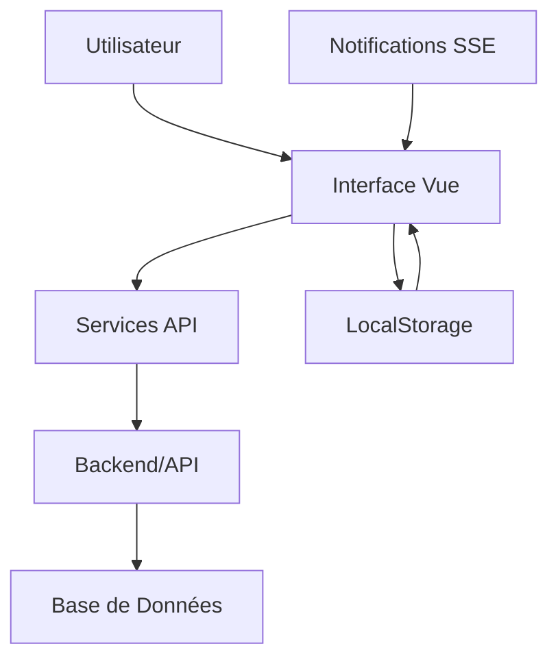

# 🔧 CCC Web News - Documentation Technique Complète

## 📋 Table des Matières

1. [Architecture du Système](#-architecture-du-système)
2. [Installation et Configuration](#-installation-et-configuration)
3. [Structure du Projet](#-structure-du-projet)
4. [Composants Principaux](#️-composants-principaux)
5. [Services et API](#-services-et-api)
6. [Système de Permissions](#-système-de-permissions)
7. [Gestion d'État](#-gestion-détat)
8. [Déploiement](#-déploiement)
9. [Tests et Monitoring](#-tests-et-monitoring)

---

## 🏗️ Architecture du Système

### Vue d'Ensemble


**CCC Web News** est une application Vue.js 3 moderne utilisant :

- **Frontend** : Vue.js 3 + Composition API
- **Build Tool** : Vite
- **Styling** : CSS moderne avec variables CSS
- **State Management** : Reactive refs et computed
- **Routing** : Navigation par onglets/états
- **Authentication** : JWT + OTP
- **Notifications** : SSE (Server-Sent Events)

### Flux de Données



## 📦 Installation et Configuration

### Prérequis

```bash
# Versions requises
Node.js >= 18.0.0
npm >= 9.0.0
```

### Installation

```bash
# Clone du repository
git clone https://github.com/Don-kabu/ccc_web_news.git
cd ccc_web_news

# Installation des dépendances
npm install

# Configuration PWA (optionnel)
npm install @vue/cli-plugin-pwa

# Configuration mobile (optionnel)
npm install @capacitor/core @capacitor/cli
```

### Variables d'Environnement

```bash
# .env.development
VITE_API_BASE_URL=http://localhost:8000/api/v1
VITE_APP_NAME=CCC Web News
VITE_APP_ENV=development

# .env.production
VITE_API_BASE_URL=https://api.cccwebnews.com/v1
VITE_APP_NAME=CCC Web News
VITE_APP_ENV=production
```

### Commandes de Développement

```bash
# Développement local
npm run dev

# Build de production
npm run build

# Preview de production
npm run preview

# Tests
npm run test

# Linting
npm run lint
```

---

## 📁 Structure du Projet

```
ccc_web_news/
├── docs/                          # Documentation
│   ├── photo/                     # Captures d'écran
│   ├── GUIDE-UTILISATEUR-COMPLET.md
│   └── *.md                       # Docs techniques
├── public/                        # Fichiers statiques
│   ├── favicon.ico
│   └── manifest.json
├── src/                          # Code source
│   ├── components/               # Composants Vue
│   │   ├── auth/                 # Authentification
│   │   ├── common/               # Composants réutilisables
│   │   ├── layout/               # Mise en page
│   │   ├── pages/                # Pages principales
│   │   └── ui/                   # Éléments d'interface
│   ├── composables/              # Hooks Vue
│   ├── services/                 # Logique métier
│   ├── App.vue                   # Composant racine
│   └── main.js                   # Point d'entrée
├── package.json                  # Dépendances
├── vite.config.js               # Configuration Vite
└── README.md                    # Documentation principale
```

---

## ⚙️ Composants Principaux

### App.vue - Composant Racine

Le composant principal gère :

```vue
<template>
  <!-- Interface d'authentification -->
  <div v-if="!isAuthenticated" class="auth-container">
    <LoginForm @login-success="handleLoginSuccess" />
    <RegisterForm @registration-success="handleRegisterSuccess" />
  </div>

  <!-- Interface principale -->
  <div v-else class="main-interface">
    <Navbar />
    <main class="main-content">
      <!-- Contenu dynamique par onglet -->
    </main>
  </div>
</template>
```

**Responsabilités** :
- Navigation entre auth/app
- Gestion de l'état utilisateur global
- Initialisation des services
- Routing par onglets

### Authentification

#### LoginForm.vue


```vue
<script setup>
import { authService } from '@/services/auth.service.js'

const handleLogin = async () => {
  const response = await authService.login(credentials)
  if (response.success) {
    emit('login-success', response.user)
  }
}
</script>
```

#### RegisterForm.vue


**Processus multi-étapes** :
1. **Vérification Email** : OTP par email
2. **Formulaire Complet** : Université + Admin
3. **Succès** : Confirmation et redirection

```vue
<script setup>
const currentStep = ref(1) // 1: Email, 2: Form, 3: Success

const handleEmailVerified = (email) => {
  verifiedEmail.value = email
  currentStep.value = 2
}

const handleRegister = async () => {
  const response = await authService.registerUniversity(data)
  if (response.success) {
    currentStep.value = 3
  }
}
</script>
```

### Pages Principales

#### HomePage.vue


```vue
<script setup>
import { newsService } from '@/services/news.service.js'

const featuredNews = ref([])
const recentNews = ref([])

onMounted(async () => {
  await loadFeaturedNews()
  await loadRecentNews()
})
</script>
```

#### PublishPage.vue


```vue
<script setup>
import { usePermissions } from '@/composables/usePermissions.js'
const { hasPermission } = usePermissions(currentUser)

const canPublish = computed(() => 
  hasPermission(PERMISSIONS.CREATE_NEWS)
)

const publishArticle = async () => {
  if (!canPublish.value) return
  
  const response = await newsService.createNews(articleData)
  if (response.success) {
    emit('article-published', response.data)
  }
}
</script>
```

#### AdminPage.vue


**Interface d'administration avec onglets** :

```vue
<template>
  <div class="admin-tabs">
    <button @click="activeTab = 'users'">Utilisateurs</button>
    <button @click="activeTab = 'settings'">Paramètres</button>
    <button @click="activeTab = 'stats'">Statistiques</button>
  </div>

  <!-- Gestion des utilisateurs -->
  <div v-if="activeTab === 'users'">
    <!-- Liste, recherche, modification -->
  </div>

  <!-- Statistiques -->
  <div v-if="activeTab === 'stats'">
    <!-- Métriques et graphiques -->
  </div>
</template>
```

---

## 🛠️ Services et API

### Architecture des Services

```javascript
// services/http.service.js
class HttpService {
  constructor() {
    this.baseURL = import.meta.env.VITE_API_BASE_URL
  }

  async request(endpoint, options = {}) {
    const token = localStorage.getItem('authToken')
    const headers = {
      'Content-Type': 'application/json',
      ...(token && { Authorization: `Bearer ${token}` }),
      ...options.headers
    }

    const response = await fetch(`${this.baseURL}${endpoint}`, {
      ...options,
      headers
    })

    return this.handleResponse(response)
  }
}
```

### Services Principaux

#### authService
```javascript
class AuthService {
  async login(credentials) {
    const response = await httpService.post('/auth/login', credentials)
    if (response.success) {
      this.setAuthToken(response.data.token)
      this.setCurrentUser(response.data.user)
    }
    return response
  }

  async registerUniversity(data) {
    return await httpService.post('/auth/register-university', data)
  }

  async sendOTP(email) {
    return await httpService.post('/auth/send-otp', { email })
  }

  async verifyOTP(email, code) {
    return await httpService.post('/auth/verify-otp', { email, code })
  }
}
```

#### newsService
```javascript
class NewsService {
  async getNews(filters = {}) {
    return await httpService.get('/news', { params: filters })
  }

  async createNews(newsData) {
    return await httpService.post('/news', newsData)
  }

  async updateNews(id, updates) {
    return await httpService.put(`/news/${id}`, updates)
  }

  async deleteNews(id) {
    return await httpService.delete(`/news/${id}`)
  }
}
```

#### notificationService
```javascript
class NotificationService {
  async initializeSSE(userId) {
    const eventSource = new EventSource(
      `/api/v1/notifications/stream/?user_id=${userId}`,
      {
        headers: {
          Authorization: `Bearer ${this.getAuthToken()}`
        }
      }
    )

    eventSource.onmessage = (event) => {
      const notification = JSON.parse(event.data)
      this.handleNotification(notification)
    }

    return eventSource
  }

  handleNotification(notification) {
    // Mise à jour UI
    // Stockage local
    // Événements custom
  }
}
```

---

## 🔐 Système de Permissions

### Définition des Rôles

```javascript
// composables/usePermissions.js
export const ROLES = {
  STUDENT: 'STUDENT',
  PUBLIANT: 'PUBLIANT', 
  MODERATOR: 'MODERATOR',
  ADMIN: 'ADMIN'
}

export const PERMISSIONS = {
  CREATE_NEWS: 'create_news',
  EDIT_NEWS: 'edit_news',
  DELETE_NEWS: 'delete_news',
  MODERATE_NEWS: 'moderate_news',
  MANAGE_USERS: 'manage_users',
  VIEW_STATS: 'view_stats'
}
```

### Matrice Permissions/Rôles

| Permission | Student | Publiant | Moderator | Admin |
|------------|---------|----------|-----------|-------|
| CREATE_NEWS | ❌ | ✅ | ✅ | ✅ |
| EDIT_NEWS | ❌ | ✅* | ✅ | ✅ |
| DELETE_NEWS | ❌ | ✅* | ✅ | ✅ |
| MODERATE_NEWS | ❌ | ❌ | ✅ | ✅ |
| MANAGE_USERS | ❌ | ❌ | ❌ | ✅ |
| VIEW_STATS | ❌ | ❌ | ✅ | ✅ |

*\*Seulement ses propres articles*

### Utilisation des Permissions

```vue
<script setup>
import { usePermissions } from '@/composables/usePermissions.js'

const { hasPermission } = usePermissions(currentUser)

const canCreateNews = computed(() => 
  hasPermission(PERMISSIONS.CREATE_NEWS)
)

const canManageUsers = computed(() => 
  hasPermission(PERMISSIONS.MANAGE_USERS)
)
</script>

<template>
  <button v-if="canCreateNews" @click="createNews">
    Publier Article
  </button>
  
  <div v-if="canManageUsers" class="admin-panel">
    <!-- Interface admin -->
  </div>
</template>
```

---

## 📊 Gestion d'État

### Architecture Réactive

```vue
<script setup>
// État global dans App.vue
const currentUser = ref(null)
const activeTab = ref('accueil')
const notifications = ref([])

// Computed dérivés
const isAuthenticated = computed(() => currentUser.value !== null)
const unreadCount = computed(() => 
  notifications.value.filter(n => !n.read).length
)

// Watchers pour synchronisation
watch(currentUser, (newUser) => {
  if (newUser) {
    notificationService.initializeUser(newUser.id)
  }
})
</script>
```

### Persistance Locale

```javascript
// Données persistées dans localStorage
const STORAGE_KEYS = {
  USER: 'ccc_currentUser',
  SETTINGS: 'ccc_settings',
  THEME: 'ccc_theme',
  NOTIFICATIONS: 'ccc_notifications'
}

// Service de persistance
class StorageService {
  saveUser(user) {
    localStorage.setItem(STORAGE_KEYS.USER, JSON.stringify(user))
  }

  loadUser() {
    const saved = localStorage.getItem(STORAGE_KEYS.USER)
    return saved ? JSON.parse(saved) : null
  }

  clearAll() {
    Object.values(STORAGE_KEYS).forEach(key => {
      localStorage.removeItem(key)
    })
  }
}
```

---

## 🚀 Déploiement

### Configuration Docker

```dockerfile
# Dockerfile
FROM node:18-alpine as build

WORKDIR /app
COPY package*.json ./
RUN npm ci

COPY . .
RUN npm run build

FROM nginx:alpine
COPY --from=build /app/dist /usr/share/nginx/html
COPY nginx.conf /etc/nginx/nginx.conf

EXPOSE 80
CMD ["nginx", "-g", "daemon off;"]
```

### Docker Compose

```yaml
# docker-compose.yml
version: '3.8'
services:
  frontend:
    build: .
    ports:
      - "80:80"
    environment:
      - VITE_API_BASE_URL=https://api.example.com
    volumes:
      - ./nginx.conf:/etc/nginx/nginx.conf
```

### Configuration Nginx

```nginx
# nginx.conf
server {
    listen 80;
    server_name localhost;
    root /usr/share/nginx/html;
    index index.html;

    # Gzip compression
    gzip on;
    gzip_types text/plain text/css application/json application/javascript;

    # SPA routing
    location / {
        try_files $uri $uri/ /index.html;
    }

    # API proxy
    location /api/ {
        proxy_pass https://api.backend.com/;
        proxy_set_header Host $host;
        proxy_set_header X-Forwarded-For $proxy_add_x_forwarded_for;
    }

    # SSE streaming
    location /api/v1/notifications/stream/ {
        proxy_pass https://api.backend.com/api/v1/notifications/stream/;
        proxy_set_header Connection '';
        proxy_http_version 1.1;
        chunked_transfer_encoding off;
        proxy_buffering off;
        proxy_cache off;
    }
}
```

### Scripts de Déploiement

```bash
#!/bin/bash
# deploy.sh

echo "🚀 Déploiement CCC Web News"

# Build
echo "📦 Build de production..."
npm run build

# Tests
echo "🧪 Tests..."
npm run test

# Docker
echo "🐳 Build Docker..."
docker build -t ccc-web-news .

# Deploy
echo "🌐 Déploiement..."
docker-compose up -d

echo "✅ Déploiement terminé !"
```

---

## 🧪 Tests et Monitoring

### Tests Unitaires

```javascript
// tests/components/LoginForm.test.js
import { mount } from '@vue/test-utils'
import LoginForm from '@/components/auth/LoginForm.vue'

describe('LoginForm', () => {
  it('émet login-success avec données correctes', async () => {
    const wrapper = mount(LoginForm)
    
    await wrapper.find('#email').setValue('test@university.com')
    await wrapper.find('#password').setValue('password123')
    await wrapper.find('form').trigger('submit.prevent')
    
    expect(wrapper.emitted('login-success')).toBeTruthy()
  })
})
```

### Tests E2E

```javascript
// tests/e2e/auth.spec.js
import { test, expect } from '@playwright/test'

test('processus d\'inscription complet', async ({ page }) => {
  await page.goto('/')
  
  // Étape 1: Email
  await page.click('button:has-text("Nouvelle Institution")')
  await page.fill('#email', 'admin@newuni.edu')
  await page.click('button:has-text("Envoyer")')
  
  // Étape 2: OTP (mock)
  await page.fill('#otp', '123456')
  await page.click('button:has-text("Vérifier")')
  
  // Étape 3: Formulaire
  await page.fill('#university_name', 'Test University')
  await page.selectOption('#university_type', 'PUBLIC')
  await page.fill('#admin_first_name', 'John')
  await page.fill('#admin_last_name', 'Doe')
  await page.fill('#admin_password', 'SecurePass123!')
  
  await page.click('button:has-text("Créer l\'institution")')
  
  // Vérification redirection
  await expect(page.locator('.main-interface')).toBeVisible()
})
```

### Monitoring Performance

```javascript
// utils/monitoring.js
class PerformanceMonitor {
  static trackPageLoad(pageName) {
    const startTime = performance.now()
    
    window.addEventListener('load', () => {
      const loadTime = performance.now() - startTime
      console.log(`📊 ${pageName} chargée en ${loadTime.toFixed(2)}ms`)
      
      // Envoi vers service d'analytics
      if (window.gtag) {
        gtag('event', 'page_load_time', {
          event_category: 'Performance',
          event_label: pageName,
          value: Math.round(loadTime)
        })
      }
    })
  }

  static trackUserAction(action, data = {}) {
    console.log(`👤 Action: ${action}`, data)
    
    // Analytics
    if (window.gtag) {
      gtag('event', action, {
        event_category: 'User Interaction',
        ...data
      })
    }
  }
}
```

### Health Checks

```javascript
// utils/healthCheck.js
class HealthChecker {
  static async checkAPIHealth() {
    try {
      const response = await fetch('/api/v1/health')
      const data = await response.json()
      
      return {
        status: response.ok ? 'healthy' : 'degraded',
        response_time: data.response_time,
        version: data.version
      }
    } catch (error) {
      return {
        status: 'down',
        error: error.message
      }
    }
  }

  static async checkLocalStorageQuota() {
    try {
      const test = 'quota_test'
      localStorage.setItem(test, 'test')
      localStorage.removeItem(test)
      return { status: 'available' }
    } catch (error) {
      return { 
        status: 'quota_exceeded',
        error: error.message 
      }
    }
  }
}
```

---

## 🔧 Configuration Avancée

### PWA (Progressive Web App)

```javascript
// vite.config.js
import { VitePWA } from 'vite-plugin-pwa'

export default {
  plugins: [
    VitePWA({
      registerType: 'autoUpdate',
      workbox: {
        globPatterns: ['**/*.{js,css,html,ico,png,svg}']
      },
      manifest: {
        name: 'CCC Web News',
        short_name: 'CCC News',
        description: 'Plateforme de gestion des actualités universitaires',
        theme_color: '#667eea',
        background_color: '#ffffff',
        display: 'standalone',
        icons: [
          {
            src: 'icon-192x192.png',
            sizes: '192x192',
            type: 'image/png'
          }
        ]
      }
    })
  ]
}
```

### Optimisations de Performance

```javascript
// Code splitting par route
const HomePage = defineAsyncComponent(() => import('@/pages/HomePage.vue'))
const AdminPage = defineAsyncComponent(() => import('@/pages/AdminPage.vue'))

// Lazy loading des images
const LazyImage = {
  props: ['src', 'alt'],
  template: `
    
  `,
  data() {
    return {
      loaded: false,
      placeholder: 'data:image/svg+xml;base64,...' // Base64 placeholder
    }
  }
}

// Debounce pour recherche
import { debounce } from 'lodash-es'

const search = ref('')
const debouncedSearch = debounce(async (query) => {
  if (query.length > 2) {
    const results = await searchService.search(query)
    searchResults.value = results
  }
}, 300)

watch(search, debouncedSearch)
```

---

*Documentation technique mise à jour le : Novembre 2025*  
*Version : 2.0*  
*CCC Web News - Plateforme de gestion des actualités universitaires*