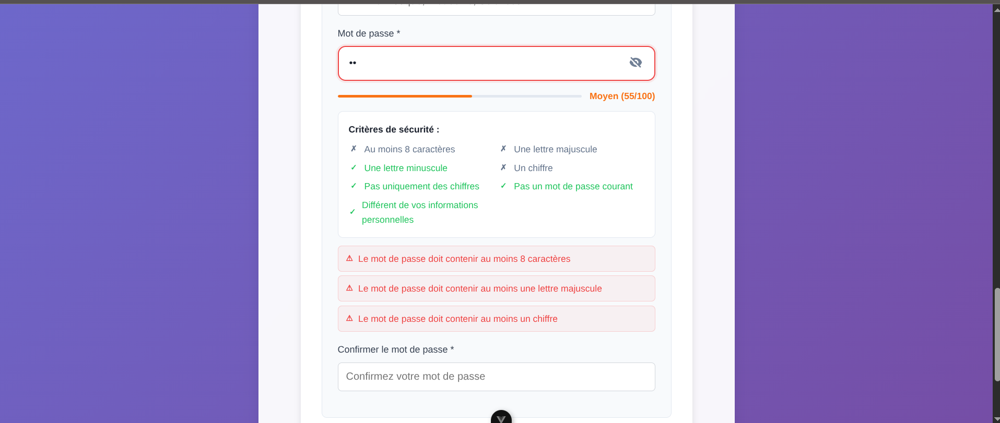

# 📚 CCC Web News - Guide Utilisateur Complet

## 🎯 Table des Matières

1. [Introduction](#-introduction)
2. [Démarrage Rapide](#-démarrage-rapide)
3. [Créer un Compte et une Université](#-créer-un-compte-et-une-université)
4. [Interface Principale](#-interface-principale)
5. [Gestion des Actualités](#-gestion-des-actualités)
6. [Administration](#-administration)
7. [Paramètres et Notifications](#️-paramètres-et-notifications)
8. [Résolution de Problèmes](#-résolution-de-problèmes)
9. [FAQ](#-faq)

---

## 🌟 Introduction

**CCC Web News** est une plateforme moderne de gestion des actualités universitaires permettant aux institutions d'enseignement supérieur de :

- 📰 **Publier et gérer** leurs actualités
- 🏫 **Organiser** les informations par université
- 👥 **Contrôler l'accès** avec un système de permissions
- 🔔 **Notifier** les utilisateurs en temps réel
- 📊 **Analyser** les statistiques de publication

### Fonctionnalités Principales

- ✅ **Interface responsive** et moderne
- ✅ **Système de rôles** (Étudiant, Publiant, Modérateur, Admin)
- ✅ **Modération** des contenus
- ✅ **Notifications** en temps réel
- ✅ **Thème jour/nuit**
- ✅ **Multi-université** avec isolation des données

---

## 🚀 Démarrage Rapide

### Connexion Existante

Si vous avez déjà un compte dans une université existante :

1. **Accédez à la page de connexion**
2. **Saisissez votre email** et mot de passe
3. **Cliquez sur "Se connecter"**

### Première Utilisation

Si votre université n'est pas encore enregistrée, passez à la section [Créer un Compte et une Université](#-créer-un-compte-et-une-université).

---

## 🏫 Créer un Compte et une Université

### Étape 1 : Inscription

1. **Cliquez sur "Nouvelle Institution"** sur la page d'accueil

### Étape 2 : Vérification Email

2. **Saisissez votre email institutionnel**
3. **Cliquez sur "Envoyer le code de vérification"**

4. **Vérifiez votre boîte email** pour recevoir le code OTP

### Étape 3 : Vérification OTP

5. **Saisissez le code de vérification** reçu par email
6. **Cliquez sur "Vérifier"**

### Étape 4 : Informations Complètes

7. **Remplissez les informations de votre université** :
   - Nom de l'institution
   - Type (Publique, Privée, Institut, École)
   - Ville et Pays
   - Site web (optionnel)
   - Description (optionnel)

8. **Créez votre compte administrateur** :
   - Prénom et nom
   - Mot de passe sécurisé
   - Numéro de téléphone

9. **Cliquez sur "Créer l'institution"**
10. **Félicitations !** Vous êtes maintenant administrateur de votre université

---

## 🏠 Interface Principale

### Page d'Accueil

L'interface principale comprend :

1. **Barre de navigation supérieure** avec :
   - Logo et nom de l'université
   - Menu de navigation (Accueil, Actualités, Publication, etc.)
   - Notifications et profil utilisateur
   - Commutateur thème jour/nuit

2. **Contenu principal** adaptatif selon la page active

3. **Cartes d'actualités** avec :
   - Image de couverture
   - Titre et résumé
   - Informations de publication
   - Actions disponibles selon vos permissions

### Navigation par Rôle

Le menu de navigation s'adapte à votre rôle :

- **👨‍🎓 Étudiant** : Accueil, Actualités, Profil
- **✍️ Publiant** : + Publication
- **🛡️ Modérateur** : + Modération
- **👑 Admin** : + Administration

---

## 📰 Gestion des Actualités

### Consultation des Actualités

**Pour tous les utilisateurs** :
- Visualisez toutes les actualités de votre université
- Filtrez par catégorie, date, importance
- Recherchez par mots-clés
- Lisez le contenu complet en cliquant sur un article

### Publication d'Actualités

**Pour les Publiants et plus** :

1. **Accédez à l'onglet "Publier"**
2. **Remplissez le formulaire** :
   - Titre de l'actualité
   - Résumé court
   - Contenu complet
   - Catégorie
   - Niveau d'importance
   - Image de couverture (optionnel)

3. **Choisissez les options de publication** :
   - **Publier maintenant** : Article visible immédiatement (après modération si requise)
   - **Programmer** : Définir une date et heure de publication
   - **Brouillon** : Sauvegarder pour plus tard

4. **Cliquez sur "Publier l'actualité"**

### Validation et Modération

Les articles passent par différents états :
- **📝 Brouillon** : En cours de rédaction
- **⏳ En attente** : Soumis pour modération
- **✅ Approuvé** : Publié et visible
- **❌ Rejeté** : Refusé avec commentaires

---

## ⚙️ Administration

### Tableau de Bord Administrateur

**Pour les Administrateurs uniquement** :

### Gestion des Utilisateurs

1. **Visualisez tous les utilisateurs** de votre université
2. **Filtrez par rôle** (Étudiant, Publiant, Modérateur, Admin)
3. **Recherchez** par nom ou email
4. **Modifiez les rôles** et informations
5. **Activez/Désactivez** des comptes

### Statistiques

**Suivez les métriques importantes** :
- 📊 Nombre total d'articles publiés
- 👥 Utilisateurs actifs
- ⏳ Articles en attente de modération
- 📈 Évolution des publications
- 📊 Répartition par catégories

### Paramètres Système

**Configurez votre plateforme** :
- Rôle par défaut pour nouveaux utilisateurs
- Modération obligatoire ou non
- Notifications email
- Limite de taille des fichiers

---

## 🔔 Paramètres et Notifications

### Paramètres de Notifications

**Personnalisez vos notifications** :

1. **Cliquez sur l'icône notifications** dans la barre supérieure
2. **Accédez aux paramètres** via l'icône engrenage
3. **Configurez vos préférences** :
   - Types de notifications à recevoir
   - Fréquence des emails
   - Notifications push (si disponible)
   - Filtres par importance

### Profil Personnel

**Gérez votre profil** :

1. **Cliquez sur votre avatar** dans la barre supérieure
2. **Modifiez vos informations** :
   - Photo de profil
   - Nom et prénom
   - Email de contact
   - Numéro de téléphone
   - Mot de passe

3. **Sauvegardez les modifications**

---

## ⚠️ Résolution de Problèmes

### Problèmes de Connexion

**❌ Email ou mot de passe incorrect**
- Vérifiez la casse de votre email
- Utilisez la fonction "Mot de passe oublié"
- Contactez votre administrateur université

**❌ Compte non vérifié**
- Vérifiez votre boîte email pour le code OTP
- Vérifiez le dossier spam
- Demandez un nouveau code si expiré

### Problèmes de Publication

**❌ Impossible de publier**
- Vérifiez que vous avez le rôle "Publiant" minimum
- Assurez-vous que tous les champs obligatoires sont remplis
- Respectez la limite de taille pour les images

**❌ Article en attente longtemps**
- Les articles nécessitent une modération
- Contactez un modérateur de votre université
- Vérifiez que le contenu respecte les règles

### Problèmes de Performance

**❌ Interface lente**
- Vérifiez votre connexion internet
- Actualisez la page (F5)
- Videz le cache du navigateur

**❌ Images ne s'affichent pas**
- Vérifiez le format (JPG, PNG supportés)
- Réduisez la taille si trop volumineuse
- Essayez de recharger l'image

---

## ❓ FAQ

### Questions Générales

**Q : Puis-je changer d'université ?**
R : Non, chaque compte est lié à une université. Contactez l'admin pour des exceptions.

**Q : Comment devenir publiant ?**
R : Contactez votre administrateur université pour obtenir ce rôle.

**Q : Les articles sont-ils modérés ?**
R : Cela dépend de la configuration de votre université. Vérifiez avec votre admin.

### Questions Techniques

**Q : Quels navigateurs sont supportés ?**
R : Chrome, Firefox, Safari, Edge (versions récentes).

**Q : L'application fonctionne-t-elle sur mobile ?**
R : Oui, l'interface est entièrement responsive.

**Q : Puis-je utiliser l'application hors ligne ?**
R : Fonctionnalités limitées hors ligne, connexion requise pour publier.

### Questions de Sécurité

**Q : Mes données sont-elles sécurisées ?**
R : Oui, chiffrement HTTPS, données isolées par université.

**Q : Comment changer mon mot de passe ?**
R : Via les paramètres de profil ou "Mot de passe oublié" à la connexion.

**Q : Qui peut voir mes articles ?**
R : Seuls les utilisateurs de votre université peuvent voir vos articles.

---

## 📞 Support

### Contacter le Support

**🏫 Support Université**
- Contactez votre administrateur local
- Utilisez les canaux internes de communication

**💻 Support Technique**
- Email : support@cccwebnews.com
- Documentation : [docs.cccwebnews.com](https://docs.cccwebnews.com)

### Ressources Additionnelles

- 📖 **Documentation Technique** : Consultez les fichiers MD dans `/docs/`
- 🐛 **Signaler un Bug** : Utilisez le système de tickets interne
- 💡 **Suggestions** : Partagez vos idées via les canaux appropriés

---

*Guide mis à jour le : Novembre 2025*
*Version : 2.0*
*CCC Web News - Plateforme de gestion des actualités universitaires*