# 📚 CCC Web News - Documentation Complète

Bienvenue dans la documentation complète de CCC Web News ! Cette section contient tout ce dont vous avez besoin pour utiliser, développer et maintenir la plateforme.

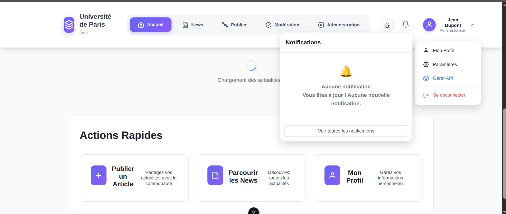

---

## 🎯 Guide de Navigation

### 👤 **Pour les Utilisateurs**

#### 🚀 Commencer Rapidement
- **[📖 Guide Utilisateur Complet](GUIDE-UTILISATEUR-COMPLET.md)** - Manuel d'utilisation détaillé avec captures d'écran
- **[⚡ Installation Rapide](INSTALLATION-RAPIDE.md)** - Démarrer en 5 minutes

#### 📸 Captures d'Écran Détaillées
Explorez l'interface avec nos captures d'écran :
- [**Processus d'inscription**](photo/register1.png) - Création d'une nouvelle université
- [**Vérification OTP**](photo/verifyopt.png) - Sécurité email
- [**Interface de publication**](photo/publish.png) - Créer des actualités
- [**Administration**](photo/statistics.png) - Gestion et statistiques

### 👨‍💻 **Pour les Développeurs**

#### 🔧 Documentation Technique
- **[📋 Documentation Technique Complète](DOCUMENTATION-TECHNIQUE-COMPLETE.md)** - Architecture, services, API
- **[💻 Guide de Développement](GUIDE-DEVELOPPEMENT.md)** - Conventions, tests, contribution

#### 📦 Ressources Spécialisées
- **[01-APP-PRINCIPAL.md](01-APP-PRINCIPAL.md)** - Structure de l'application principale
- **[02-AUTHENTIFICATION.md](02-AUTHENTIFICATION.md)** - Système d'authentification
- **[03-PAGES-PRINCIPALES.md](03-PAGES-PRINCIPALES.md)** - Architecture des pages
- **[04-GESTION-ACTUALITES.md](04-GESTION-ACTUALITES.md)** - Système de news
- **[05-ADMINISTRATION.md](05-ADMINISTRATION.md)** - Interface d'administration
- **[06-SERVICES-API.md](06-SERVICES-API.md)** - Services et API
- **[07-SYSTEME-PERMISSIONS.md](07-SYSTEME-PERMISSIONS.md)** - Gestion des permissions
- **[08-NOTIFICATIONS.md](08-NOTIFICATIONS.md)** - Système de notifications

---

## 🖼️ Galerie d'Interface

### Authentification et Inscription

| Étape | Capture | Description |
|-------|---------|-------------|
| Connexion | 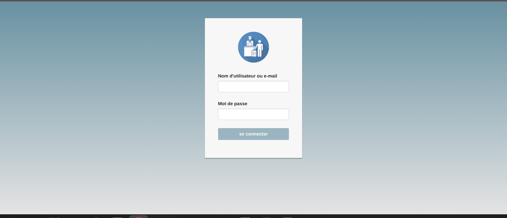 | Interface de connexion sécurisée |
| Email | 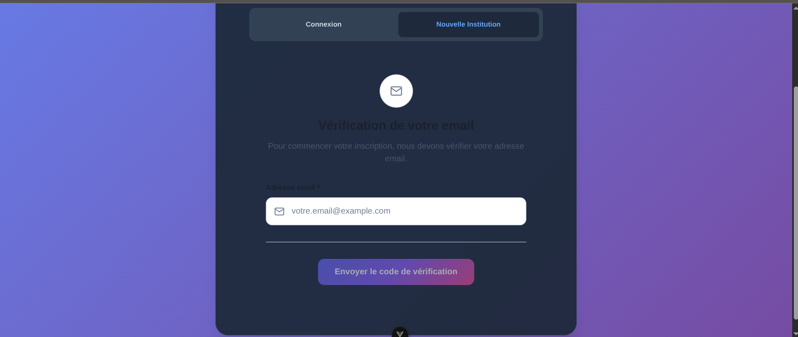 | Saisie email avec validation |
| OTP | 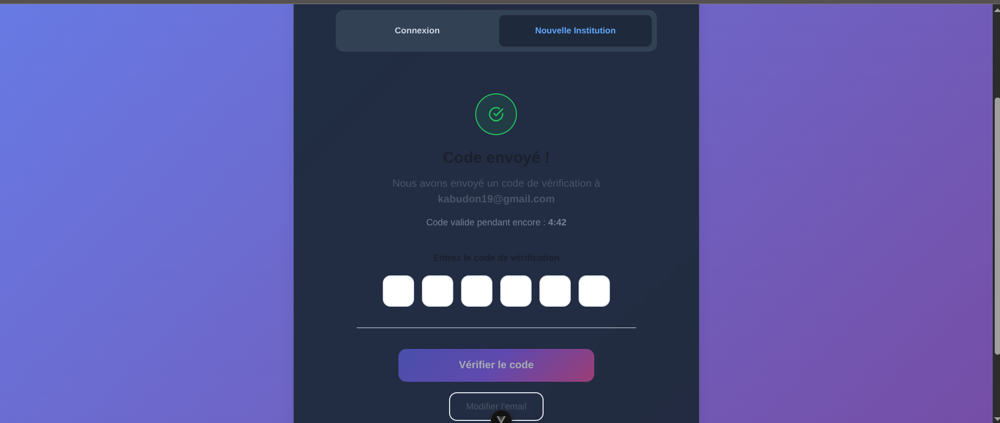 | Vérification code sécurisé |
| Inscription | 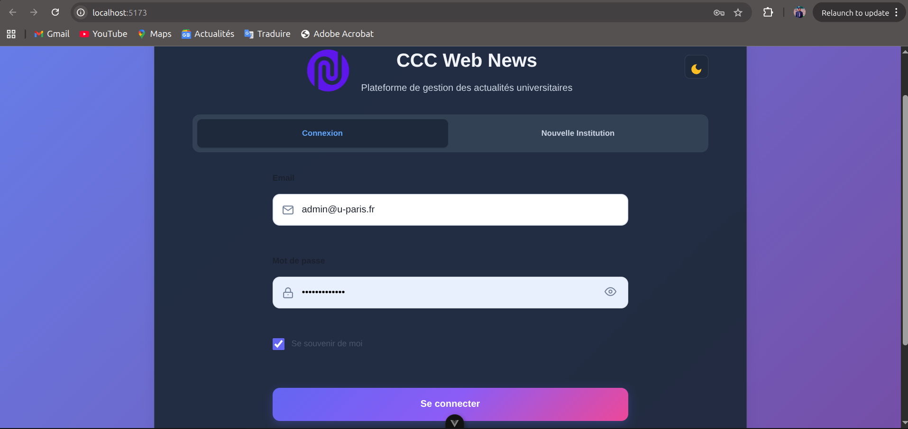 | Formulaire création université |

### Interface Principale

| Section | Capture | Fonctionnalités |
|---------|---------|-----------------|
| Accueil |  | Actualités et navigation |
| Publication | 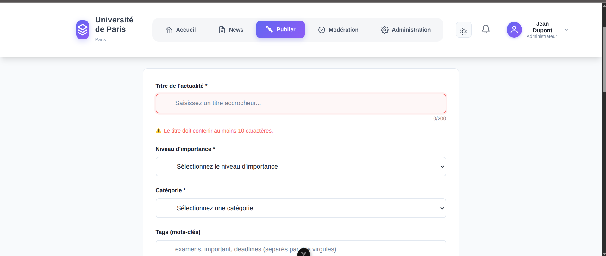 | Créer et gérer actualités |
| Lecture | 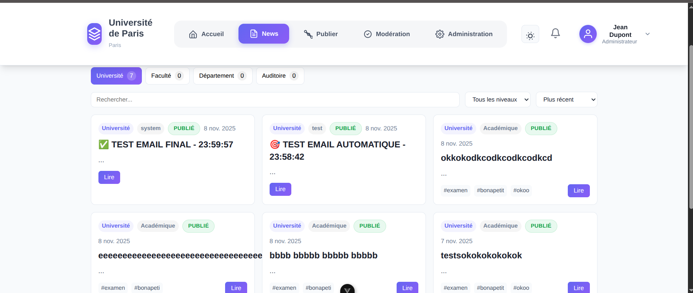 | Consultation des news |
| Notifications | 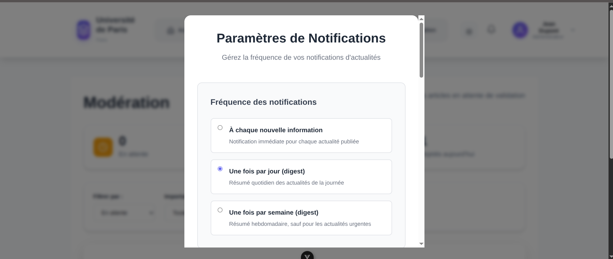 | Paramètres et alertes |

### Administration

| Fonctionnalité | Capture | Usage |
|----------------|---------|-------|
| Tableau de bord | 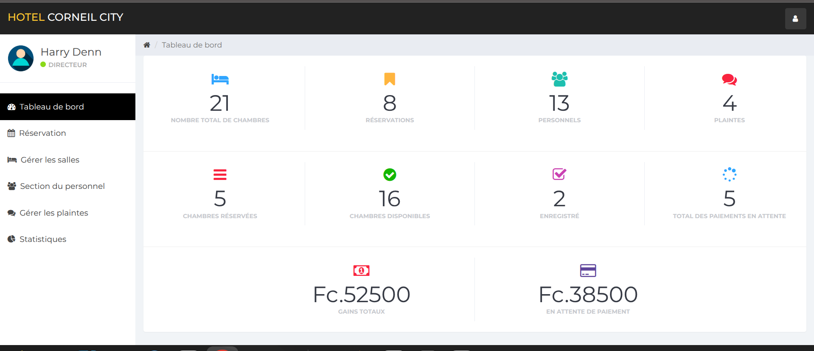 | Vue d'ensemble admin |
| Statistiques | 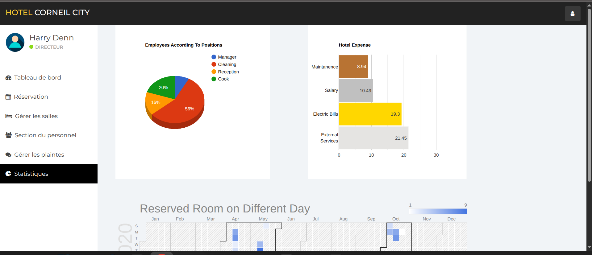 | Métriques détaillées |
| Utilisateurs | 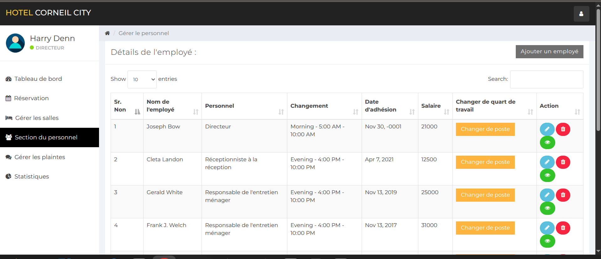 | Gestion des comptes |
| Profil | 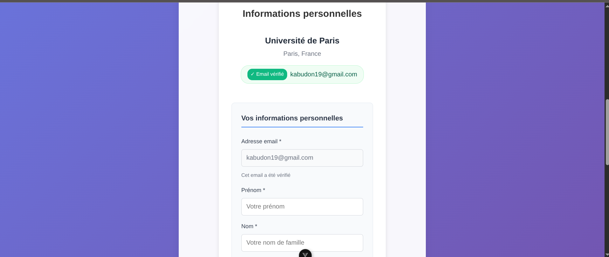 | Informations personnelles |

---

## 🎯 Workflows d'Utilisation

### 🆕 Premier Utilisateur
1. **[Créer une université](GUIDE-UTILISATEUR-COMPLET.md#-créer-un-compte-et-une-université)**
2. **[Vérifier son email](photo/verifyopt.png)**
3. **[Compléter son profil](photo/forminuniversity.png)**
4. **[Accéder à l'interface](photo/homepage.png)**

### ✍️ Publier une Actualité
1. **[Accéder à la publication](photo/publish.png)**
2. **[Rédiger le contenu](photo/publish2.png)**
3. **[Publier ou programmer](GUIDE-UTILISATEUR-COMPLET.md#publication-dactualités)**

### 🛡️ Administrer sa Plateforme
1. **[Accéder à l'admin](photo/dashboard.png)**
2. **[Gérer les utilisateurs](photo/personnel.png)**
3. **[Consulter les statistiques](photo/statistics.png)**

---

## 🔧 Pour les Développeurs

### 🏗️ Architecture
```
src/
├── components/          # Composants Vue
├── services/           # Logique métier
├── composables/        # Hooks réutilisables
└── App.vue            # Composant racine
```

### 🛠️ Stack Technique
- **Frontend** : Vue.js 3 + Composition API
- **Build** : Vite
- **Styling** : CSS moderne avec variables
- **State** : Reactive refs + computed

### 📦 Installation Développeur
```bash
# Clone et installation
git clone https://github.com/Don-kabu/ccc_web_news.git
cd ccc_web_news
npm install

# Développement
npm run dev

# Tests
npm run test

# Build production
npm run build
```

**➡️ [Guide détaillé pour développeurs](GUIDE-DEVELOPPEMENT.md)**

---

## 📞 Support et Contribution

### 🆘 Besoin d'Aide ?
- **Utilisateurs** : Consultez le [Guide Utilisateur](GUIDE-UTILISATEUR-COMPLET.md)
- **Développeurs** : Voir la [Documentation Technique](DOCUMENTATION-TECHNIQUE-COMPLETE.md)
- **Installation** : [Guide rapide](INSTALLATION-RAPIDE.md)

### 🤝 Contribuer
- **Code** : Suivez le [Guide de Développement](GUIDE-DEVELOPPEMENT.md)
- **Documentation** : Améliorez les guides existants
- **Bugs** : Reportez via les issues GitHub

### 📧 Contact
- **Support** : support@cccwebnews.com
- **Technique** : dev@cccwebnews.com
- **GitHub** : [Don-kabu/ccc_web_news](https://github.com/Don-kabu/ccc_web_news)

---

## 🏷️ Versions

| Version | Date | Changements |
|---------|------|-------------|
| **2.0** | Nov 2025 | Interface responsive, documentation complète |
| **1.5** | Oct 2025 | Système de notifications avancé |
| **1.0** | Sep 2025 | Version initiale avec fonctionnalités de base |

---

*Documentation mise à jour : Novembre 2025*  
*CCC Web News - Plateforme de gestion des actualités universitaires*